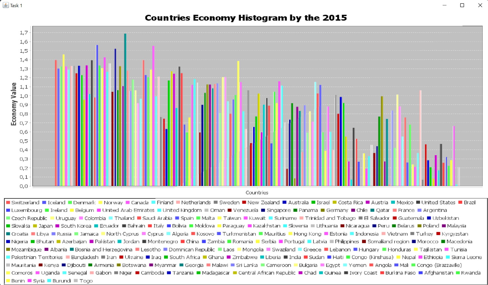
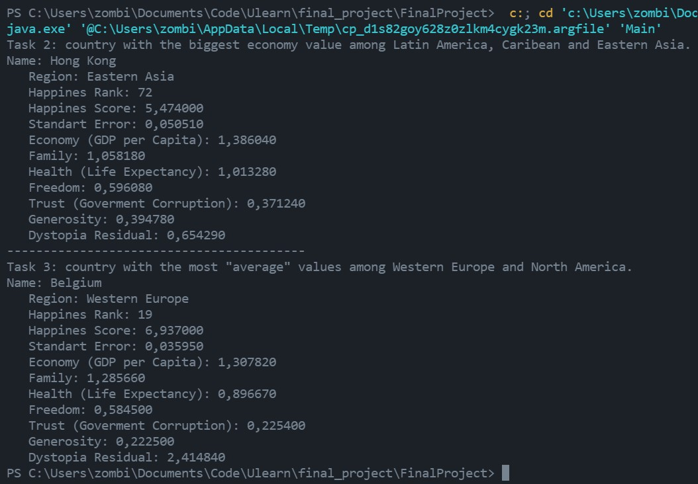

## Описание работы над проектом
Работа, представленная в данном репозитории, выполнена Золотаревым Иваном Евгеньевичем АТ-01 (РИ-200015).
## Структура проекта
 - В папке `src` находятся исходные файлы со структурами данных, которые были прописаны для выполнения задания по проекту
 - В папке `lib` находятся `.jar` файлы библиотек, использованных для написания проекта.
 - В папке `data` находятся файлы, используемые проектом во время его работы, а именно:
    1. `countries_happines_2015.csv` - `csv`-файл, который содержит данные, на основе которых программа создает базу данных.
    2. `countries_happines_2015.sqlite` - база данных `SQLite`, создаваемая проектом во время его работы (можно удалить для проверки корректности работы проекта).
 - В папке `screenshots`содержатся скриншоты, представленные в данном readme-файле.
 ## Этапы работы над проектом
 1. Создание проекта и создание структуры данных `Country`, способная хранить в себе все данные о конкретной стране.
 2. Создание структуры данных `CSVParser`, которая позволяет получить данные из `.csv`-файла и загрузить их в ранее упомянутую структуру данных.
 3. Создание структуры данных `DatabaseManager`, которая позволяет создать базу данных на основе полученной информации и в дальнейшем обращаться к ней.
 4. Создание `SQL`-запросов в соответствии с заданием проекта в основном классе проекта `Main`, вывод полученных результатов в консоль.
 5. Создание структуры данных `ChartManager`, которая позволяет строить график в соответствии с заданием проекта.
 6. Рефакторинг, создание репозитория, редактирование `README.md` файла.
 ## Результаты, полученные при выполнении проекта
 ### Результаты выполнения задания 1
 
 ### Результаты выполнения заданий 2 и 3
 